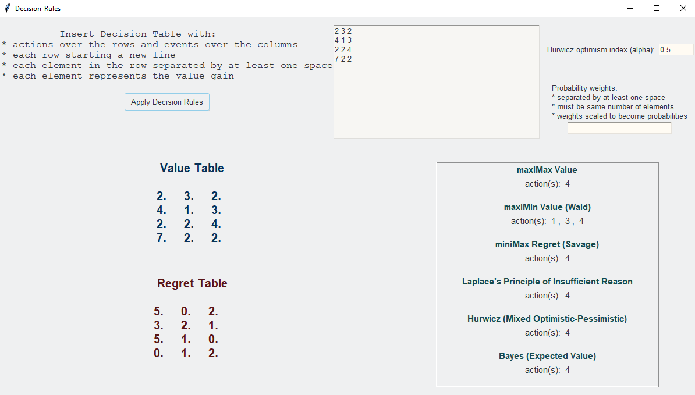
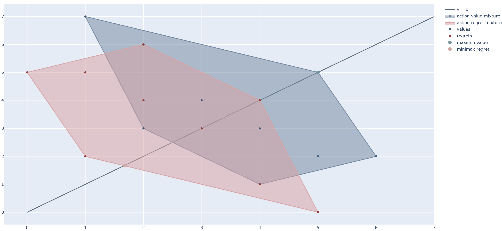

  # Decision-Rules

<div align="center">  
  <a href="https://github.com/ivanmyzou/Decision-Rules">
    
  </a>
  
  Automated Analysis of Decision Rules
</div>


## Prerequisites

Installation of Python libraries
   ```sh
   pip install numpy
   ```
   ```sh
   pip install plotly
   ```   
   ```sh
   pip install scipy
   ```     
   ```sh
   pip install ttkthemes
   ```

## Functionalities

### Applying Decision Rules

The program is `Decision_Rules.py`. Decision rules include:
* maxiMax (Value)
* maxiMin (Value)
* miniMax Regret
* Laplace 
* Hurwicz 
* Bayes

<p align="center">
	
</p>

### Action Plotting in Cartesian Plane

The program is `Action_Plots.py`, allowing visualisation of decision value set and regret set.

<p align="center">
	
</p>

## Licence

This repository is distributed under the MIT Licence. See `LICENSE.txt` for more information. 
